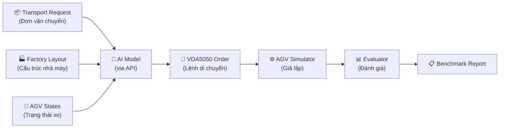
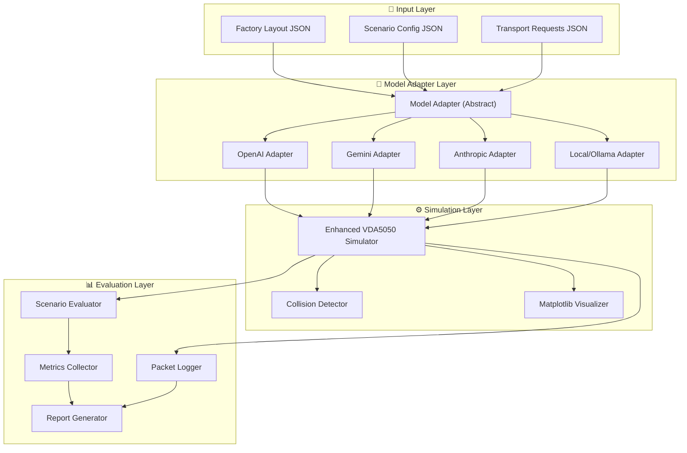
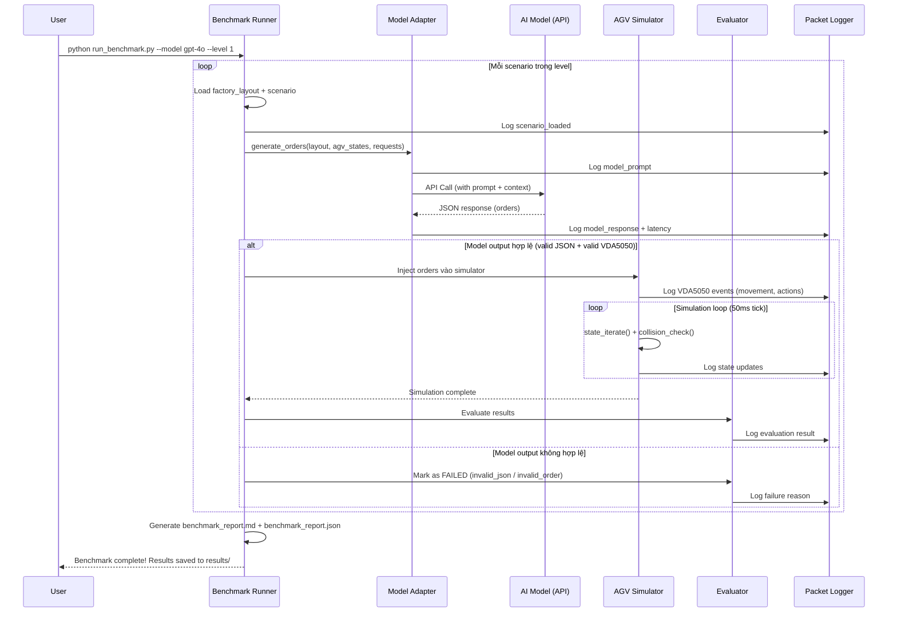

# AGV Physical Model Reasoning Benchmark

Xây dựng hệ thống benchmark đánh giá khả năng suy luận của các AI/Physical Models trong việc điều phối xe AGV tại môi trường nhà máy giả lập, dựa trên nền tảng simulator VDA 5050 hiện có.

## Tổng quan ý tưởng



**Luồng hoạt động cốt lõi:**
1. Hệ thống tải một **scenario** (kịch bản) chứa layout nhà máy + danh sách transport requests
2. Gửi dữ liệu đầu vào (layout, trạng thái AGV, request) cho **AI Model** qua API
3. AI Model trả về **VDA5050 Order** (lệnh chỉ thị di chuyển cho từng xe)
4. Hệ thống đưa lệnh vào **AGV Simulator** và theo dõi kết quả
5. **Evaluator** chấm điểm dựa trên: hoàn thành nhiệm vụ, va chạm, thời gian, pin...
6. Tất cả gói tin vào/ra được ghi lại vào file log để phân tích

---

## Kiến trúc hệ thống



---

## Cấu trúc thư mục đề xuất

```
vda5050-robot-simulator/
├── config.toml                          # Config MQTT + simulation cơ bản (GIỮ NGUYÊN)
├── config.py                            # Config loader (GIỮ NGUYÊN)
├── main.py                              # VDA5050 Simulator (SỬA: thêm collision, hooks)
├── commander_visualizer.py              # Visualizer (SỬA: thêm hiển thị obstacles, zones)
├── mqtt_utils.py                        # MQTT utilities (GIỮ NGUYÊN)
├── utils.py                             # Helper functions (GIỮ NGUYÊN)
├── protocol/                            # VDA5050 protocol definitions (GIỮ NGUYÊN)
│
├── benchmark/                           # ★ THƯ MỤC MỚI - Core benchmark engine
│   ├── __init__.py
│   ├── runner.py                        # Benchmark orchestrator chính
│   ├── evaluator.py                     # Chấm điểm kết quả simulation
│   ├── metrics.py                       # Định nghĩa và tính toán metrics
│   ├── packet_logger.py                 # Ghi lại tất cả gói tin vào/ra
│   └── report_generator.py             # Xuất báo cáo kết quả
│
├── models/                              # ★ THƯ MỤC MỚI - AI Model adapters
│   ├── __init__.py
│   ├── base_adapter.py                  # Abstract base class cho tất cả adapters
│   ├── openai_adapter.py               # Gọi GPT-4o/o3 qua OpenAI API
│   ├── gemini_adapter.py               # Gọi Gemini qua Google AI API
│   ├── anthropic_adapter.py            # Gọi Claude qua Anthropic API
│   └── ollama_adapter.py               # Gọi local models qua Ollama API
│
├── scenarios/                           # ★ THƯ MỤC MỚI - Kịch bản benchmark
│   ├── level_1_basic/                   # Cấp 1: Đơn giản
│   │   ├── scenario_001.json            # 1 xe, 1 pickup, 1 dropoff, không vật cản
│   │   ├── scenario_002.json            # 1 xe, nhiều điểm dừng, không vật cản
│   │   └── ...
│   ├── level_2_intermediate/            # Cấp 2: Trung bình
│   │   ├── scenario_010.json            # 2 xe, có vật cản tĩnh
│   │   └── ...
│   ├── level_3_advanced/                # Cấp 3: Nâng cao
│   │   ├── scenario_020.json            # Nhiều xe, vật cản, pin giới hạn
│   │   └── ...
│   └── level_4_expert/                  # Cấp 4: Chuyên gia
│       ├── scenario_030.json            # Deadlock, xe hỏng, cảm biến lỗi
│       └── ...
│
├── factory_layouts/                     # ★ THƯ MỤC MỚI - Bản đồ nhà máy
│   ├── simple_warehouse.json            # Nhà kho đơn giản
│   ├── l_shaped_factory.json            # Nhà máy hình chữ L
│   ├── multi_zone_factory.json          # Nhà máy nhiều khu vực
│   └── complex_factory.json             # Nhà máy phức tạp
│
├── results/                             # ★ THƯ MỤC MỚI - Kết quả benchmark
│   └── {model_name}_{timestamp}/
│       ├── benchmark_report.json        # Báo cáo tổng hợp
│       ├── benchmark_report.md          # Báo cáo dạng Markdown
│       ├── packet_log.jsonl             # Toàn bộ gói tin vào/ra
│       └── visualizations/              # Screenshots/recordings
│
└── run_benchmark.py                     # ★ FILE MỚI - Entry point chạy benchmark
```

---

## Chi tiết thiết kế từng thành phần

### 1. Factory Layout (Bản đồ nhà máy)

Mỗi factory layout là một file JSON mô tả cấu trúc vật lý của nhà máy:

```json
{
  "layout_id": "simple_warehouse",
  "layout_name": "Simple Warehouse Layout",
  "map_id": "warehouse_01",
  "dimensions": { "width": 20.0, "height": 15.0 },

  "nodes": [
    {
      "node_id": "DOCK_A",
      "x": 2.0, "y": 2.0,
      "type": "dock",
      "description": "Loading Dock A"
    },
    {
      "node_id": "SHELF_B1",
      "x": 10.0, "y": 8.0,
      "type": "storage",
      "description": "Storage Shelf B1"
    },
    {
      "node_id": "WP_1",
      "x": 6.0, "y": 5.0,
      "type": "waypoint",
      "description": "Waypoint 1"
    }
  ],

  "edges": [
    {
      "edge_id": "E_DOCK_WP1",
      "start_node_id": "DOCK_A",
      "end_node_id": "WP_1",
      "bidirectional": true,
      "max_speed": 1.0
    }
  ],

  "obstacles": [
    {
      "obstacle_id": "WALL_1",
      "type": "wall",
      "vertices": [[4.0, 0.0], [4.0, 3.0]]
    },
    {
      "obstacle_id": "PILLAR_1",
      "type": "circle",
      "center": [8.0, 6.0],
      "radius": 0.5
    }
  ],

  "zones": [
    {
      "zone_id": "CHARGING_ZONE",
      "type": "charging",
      "bounds": { "x_min": 0, "y_min": 0, "x_max": 3, "y_max": 3 }
    }
  ]
}
```

---

### 2. Scenario (Kịch bản benchmark)

Mỗi scenario mô tả một bài test cụ thể:

```json
{
  "scenario_id": "scenario_001",
  "scenario_name": "Single AGV - Simple Pickup and Delivery",
  "level": 1,
  "description": "1 xe AGV lấy hàng từ Dock A, giao đến Shelf B1",
  "factory_layout": "simple_warehouse",

  "agvs": [
    {
      "serial_number": "AGV_01",
      "initial_position": { "x": 2.0, "y": 2.0 },
      "battery_charge": 100.0,
      "speed": 0.5,
      "capabilities": ["pickup", "dropOff"]
    }
  ],

  "transport_requests": [
    {
      "request_id": "REQ_001",
      "pickup_node": "DOCK_A",
      "dropoff_node": "SHELF_B1",
      "priority": 1,
      "payload_type": "pallet",
      "payload_weight_kg": 50.0
    }
  ],

  "constraints": {
    "max_time_seconds": 120,
    "collision_tolerance": 0.3
  },

  "success_criteria": {
    "all_requests_delivered": true,
    "no_collisions": true,
    "battery_above": 0
  }
}
```

---

### 3. Hệ thống cấp độ Benchmark

| Cấp độ | Tên | Mô tả | Số xe | Vật cản | Ràng buộc |
|--------|------|--------|-------|---------|-----------|
| **Level 1** | Basic | Điều hướng cơ bản | 1 | Không | Không |
| **Level 2** | Intermediate | Nhiều điểm dừng + vật cản tĩnh | 1-2 | Tĩnh | Pin giới hạn |
| **Level 3** | Advanced | Multi-AGV + tránh va chạm | 3-5 | Tĩnh + Động | Pin + Thời gian |
| **Level 4** | Expert | Deadlock recovery, xe hỏng | 5+ | Phức tạp | Toàn diện |

**Chi tiết từng cấp:**

**Level 1 - Basic (5-10 scenarios):**
- Scenario 001: 1 xe, 1 pickup → 1 dropoff, đường thẳng
- Scenario 002: 1 xe, pickup → waypoint → dropoff
- Scenario 003: 1 xe, nhiều pickup/dropoff tuần tự
- Scenario 004: 1 xe, chọn đường ngắn nhất (2 đường có thể đi)
- Scenario 005: 1 xe, quay về vị trí ban đầu sau khi giao

**Level 2 - Intermediate (5-10 scenarios):**
- Scenario 010: 1 xe, né vật cản tĩnh (tường, cột)
- Scenario 011: 2 xe, mỗi xe 1 nhiệm vụ riêng biệt (không giao thoa)
- Scenario 012: 1 xe, pin giới hạn (phải đi sạc giữa chừng)
- Scenario 013: 1 xe, ưu tiên nhiệm vụ (2 request, 1 urgent)
- Scenario 014: 2 xe, phân bổ nhiệm vụ (2 request, 2 xe)

**Level 3 - Advanced (5-10 scenarios):**
- Scenario 020: 3 xe, đường hẹp 1 chiều (phải lần lượt)
- Scenario 021: 3 xe, tránh va chạm tại giao lộ
- Scenario 022: 4 xe, tối ưu phân bổ nhiệm vụ (nhiều request)
- Scenario 023: 3 xe, 1 xe pin thấp (phải chuyển nhiệm vụ)
- Scenario 024: 5 xe, deadline cho mỗi request

**Level 4 - Expert (5-10 scenarios):**
- Scenario 030: 5 xe, tình huống deadlock (2 xe chặn nhau)
- Scenario 031: 4 xe, 1 xe bị hỏng giữa đường
- Scenario 032: 5 xe, vật cản động (xe nâng di chuyển)
- Scenario 033: 6 xe, khu vực giới hạn số xe (max 2 xe/zone)
- Scenario 034: 5 xe, mất kết nối tạm thời 1 xe

---

### 4. Model Adapter Layer (Gọi AI Model)

```python
# base_adapter.py - Abstract interface
class BaseModelAdapter:
    """Base adapter cho tất cả AI Models"""

    def generate_orders(
        self,
        factory_layout: dict,
        agv_states: list[dict],
        transport_requests: list[dict],
        constraints: dict
    ) -> ModelResponse:
        """
        Input:
        - factory_layout: Bản đồ nhà máy (nodes, edges, obstacles, zones)
        - agv_states: Trạng thái hiện tại của từng xe (vị trí, pin, đang chở gì)
        - transport_requests: Danh sách yêu cầu vận chuyển
        - constraints: Ràng buộc (thời gian, va chạm...)

        Output:
        - ModelResponse chứa danh sách VDA5050 Orders cho từng xe
        """
        raise NotImplementedError
```

> [!IMPORTANT]
> **Ưu tiên gọi Model qua API:**
> - **OpenAI** (`openai_adapter.py`): Gọi GPT-4o, o3, o4-mini qua `openai` SDK
> - **Google** (`gemini_adapter.py`): Gọi Gemini 2.5 Pro/Flash qua `google-genai` SDK
> - **Anthropic** (`anthropic_adapter.py`): Gọi Claude Opus/Sonnet qua `anthropic` SDK
> - **Ollama** (`ollama_adapter.py`): Gọi models local (Qwen, Llama) qua `ollama` REST API nếu muốn thử nghiệm offline

**Prompt Engineering Strategy:**
- System prompt mô tả vai trò "Fleet Management Controller"
- Cung cấp factory layout dạng JSON cho model hiểu cấu trúc nhà máy
- Cung cấp VDA5050 Order schema để model biết format output
- Cung cấp trạng thái xe AGV hiện tại
- Cung cấp danh sách transport requests
- Yêu cầu model trả output dạng JSON (structured output) chứa danh sách Orders

---

### 5. Packet Logger (Ghi lại gói tin)

Toàn bộ giao tiếp sẽ được ghi lại trong file `packet_log.jsonl` (JSON Lines), mỗi dòng là một sự kiện:

```jsonl
{"timestamp": "2026-07-04T18:30:00Z", "direction": "INPUT", "type": "scenario_loaded", "data": {...}}
{"timestamp": "2026-07-04T18:30:01Z", "direction": "INPUT", "type": "model_prompt", "model": "gpt-4o", "data": {...}}
{"timestamp": "2026-07-04T18:30:03Z", "direction": "OUTPUT", "type": "model_response", "model": "gpt-4o", "latency_ms": 2100, "data": {...}}
{"timestamp": "2026-07-04T18:30:03Z", "direction": "OUTPUT", "type": "vda5050_order", "agv": "AGV_01", "data": {...}}
{"timestamp": "2026-07-04T18:30:05Z", "direction": "EVENT", "type": "agv_arrived_node", "agv": "AGV_01", "node": "WP_1"}
{"timestamp": "2026-07-04T18:30:10Z", "direction": "EVENT", "type": "agv_pickup_complete", "agv": "AGV_01"}
{"timestamp": "2026-07-04T18:30:20Z", "direction": "EVENT", "type": "delivery_complete", "request_id": "REQ_001"}
```

---

### 6. Metrics & Evaluator (Chỉ số đánh giá)

| Metric | Mô tả | Loại |
|--------|--------|------|
| `success_rate` | % scenarios hoàn thành thành công | Core |
| `failure_reason` | Phân loại nguyên nhân thất bại (invalid_order, collision, timeout, battery_dead, deadlock, invalid_json) | Core |
| `model_latency_ms` | Thời gian model trả về output (ms) | Performance |
| `total_simulation_time_s` | Tổng thời gian giả lập để hoàn thành | Performance |
| `total_distance_traveled` | Tổng quãng đường di chuyển (tất cả xe) | Efficiency |
| `battery_remaining_avg` | % pin trung bình còn lại sau scenario | Efficiency |
| `collision_count` | Số va chạm xảy ra | Safety |
| `order_validity_rate` | % output của model là VDA5050 Order hợp lệ | Quality |
| `optimal_path_ratio` | Tỷ lệ đường đi so với đường tối ưu | Quality |
| `deadlock_count` | Số lần bị kẹt (deadlock) | Safety |
| `requests_completed` | Số request hoàn thành / tổng request | Core |

**Báo cáo kết quả mẫu (benchmark_report.md):**

```
## Benchmark Report: GPT-4o - 2026-07-04

### Tổng quan
- Model: gpt-4o
- Tổng scenarios: 30
- Thành công: 22/30 (73.3%)
- Thời gian chạy benchmark: 45 phút

### Kết quả theo cấp độ
| Level | Pass | Fail | Success Rate |
|-------|------|------|-------------|
| L1    | 10   | 0    | 100%        |
| L2    | 8    | 2    | 80%         |
| L3    | 3    | 4    | 42.8%       |
| L4    | 1    | 2    | 33.3%       |

### Phân tích lỗi
| Failure Reason    | Count |
|-------------------|-------|
| invalid_json      | 2     |
| collision         | 3     |
| timeout           | 1     |
| deadlock          | 2     |
```

---

### 7. Enhanced Visualizer (Trực quan nâng cao)

Nâng cấp [commander_visualizer.py](file:///c:/Users/Admin/Documents/viet_code/repo_github/vda5050-robot-simulator/commander_visualizer.py) hiện tại để hiển thị thêm:

- **Obstacles** (vật cản): Vẽ tường, cột, vùng cấm lên bản đồ
- **Zones** (khu vực): Tô màu cho charging zone, storage zone
- **AGV labels**: Tên xe + % pin + trạng thái (idle/moving/charging/error)
- **Transport requests**: Hiển thị pickup/dropoff markers
- **Collision warnings**: Highlight đỏ khi phát hiện va chạm

---

## Luồng chạy Benchmark



---

## Thứ tự triển khai đề xuất

### Phase 1: Foundation (Nền tảng)
1. Tạo cấu trúc thư mục `benchmark/`, `models/`, `scenarios/`, `factory_layouts/`, `results/`
2. Thiết kế JSON schema cho factory layout và scenario
3. Tạo 2-3 factory layout mẫu (simple, medium)
4. Tạo 3-5 scenarios Level 1

### Phase 2: Model Integration (Tích hợp Model)
5. Xây dựng `base_adapter.py` (abstract class)
6. Implement `openai_adapter.py` hoặc `gemini_adapter.py` (chọn 1 adapter đầu tiên)
7. Thiết kế system prompt + output schema cho models
8. Xây dựng `packet_logger.py`

### Phase 3: Simulation Enhancement (Nâng cấp Simulator)
9. Thêm collision detection vào `main.py`
10. Thêm hỗ trợ đọc factory layout (obstacles, zones) vào simulator
11. Nâng cấp `commander_visualizer.py` hiển thị obstacles, zones

### Phase 4: Evaluation Engine (Đánh giá)
12. Xây dựng `evaluator.py` + `metrics.py`
13. Xây dựng `report_generator.py`
14. Xây dựng `runner.py` (orchestrator chính)
15. Tạo `run_benchmark.py` (entry point)

### Phase 5: Scale Up (Mở rộng)
16. Tạo thêm scenarios Level 2, 3, 4
17. Implement thêm model adapters (Gemini, Anthropic, Ollama)
18. Thêm so sánh cross-model trong report
19. Nâng cấp visualizer để record animations

### Phase 6: Full-Stack Development (Giao diện Web & Backend API)
20. **Giai đoạn kiểm thử 1 (Local Backend):**
    * Xây dựng Backend API sử dụng **FastAPI** (Python) để quản lý chạy benchmark.
    * Định nghĩa các API endpoints chính:
      * `GET /api/layouts`: Liệt kê danh sách sơ đồ nhà máy.
      * `GET /api/scenarios`: Liệt kê các kịch bản chạy thử theo cấp độ.
      * `POST /api/benchmark/run`: Nhận tham số model + scenario_id để thực thi giả lập in-memory và trả về kết quả JSON.
      * `GET /api/results`: Lấy danh sách lịch sử các lần chạy benchmark.
      * `GET /api/results/{run_id}/playback`: Cung cấp luồng dữ liệu log tọa độ từng tick của lần chạy để phục vụ render animation.
    * Thực hiện kiểm thử thủ công API qua giao diện tài liệu tự động **Swagger UI** (`http://127.0.0.1:8000/docs`).
21. **Giai đoạn kiểm thử 2 (Local Frontend):**
    * Xây dựng Frontend Single Page Application bằng **Next.js** hoặc **Vite (React + Tailwind)**.
    * Các chức năng giao diện chính:
      * Trang Dashboard: Hiển thị biểu đồ cột, biểu đồ tròn so sánh tỷ lệ thành công (Success Rate), độ trễ (Latency), va chạm giữa các Model AI.
      * Trang Playground: Cho phép chọn Bản đồ, Kịch bản, và chọn Model (GPT-4o, Gemini, Claude) từ giao diện, nhấn nút "Run Benchmark".
      * Trang Playback: Render hoạt ảnh di chuyển 2D trực tiếp trên Canvas/SVG của trình duyệt dựa trên dữ liệu playback từ API backend gửi về (tương tự như màn hình vẽ của `play_benchmark.py`).
    * Kiểm thử local tích hợp cả Frontend kết nối đến API Backend cục bộ.

### Phase 7: Deployment (Triển khai Cloud)
22. **Triển khai Backend trên Hugging Face Spaces (Docker):**
    * Thiết kế file `backend.Dockerfile` đóng gói mã nguồn Python, cài đặt các dependencies (`requirements.txt`) và chạy ứng dụng FastAPI qua Uvicorn.
    * Triển khai lên Hugging Face Spaces dưới dạng Docker Space.
23. **Triển khai Frontend trên Vercel:**
    * Cấu hình dự án Frontend để build tĩnh (Static Export) hoặc deploy serverless functions trực tiếp lên Vercel.
    * Liên kết endpoint gọi API của Frontend tới URL ứng dụng FastAPI đang chạy trên Hugging Face.

---

## Open Questions

> [!IMPORTANT]
> **Câu hỏi 1: Chọn AI Model nào làm adapter đầu tiên?**
> Bạn hiện có sẵn API key của provider nào (OpenAI, Google AI, Anthropic)? Tôi sẽ ưu tiên implement adapter đó trước.

> [!IMPORTANT]
> **Câu hỏi 2: Chế độ tương tác model - Một lần hay nhiều lần?**
> - **One-shot**: Model nhận toàn bộ thông tin 1 lần → trả về toàn bộ orders → kết thúc. Đơn giản, dễ benchmark.
> - **Multi-turn**: Model nhận thông tin → trả lệnh → nhận feedback trạng thái → trả lệnh tiếp. Phức tạp hơn nhưng thực tế hơn cho Level 3-4.
> - Bạn muốn bắt đầu với chế độ nào?

> [!IMPORTANT]
> **Câu hỏi 3: Ưu tiên Visualizer như thế nào?**
> - **Tối thiểu**: Chỉ vẽ tĩnh kết quả cuối cùng (đường đi + vật cản)
> - **Real-time**: Hiển thị animation xe di chuyển (như hiện tại nhưng nâng cấp)
> - **Xuất video**: Ghi lại animation thành file video `.mp4` để review sau
> - Bạn muốn mức nào?

> [!NOTE]
> **Câu hỏi 4: Ngôn ngữ báo cáo?**
> Báo cáo benchmark nên viết bằng tiếng Việt hay tiếng Anh? (Tiếng Anh sẽ thuận tiện nếu bạn muốn chia sẻ/publish kết quả)
