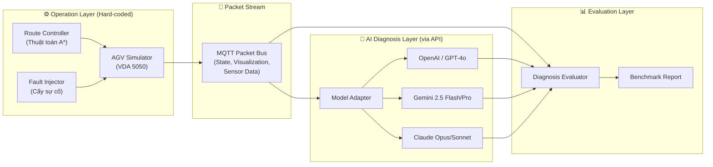
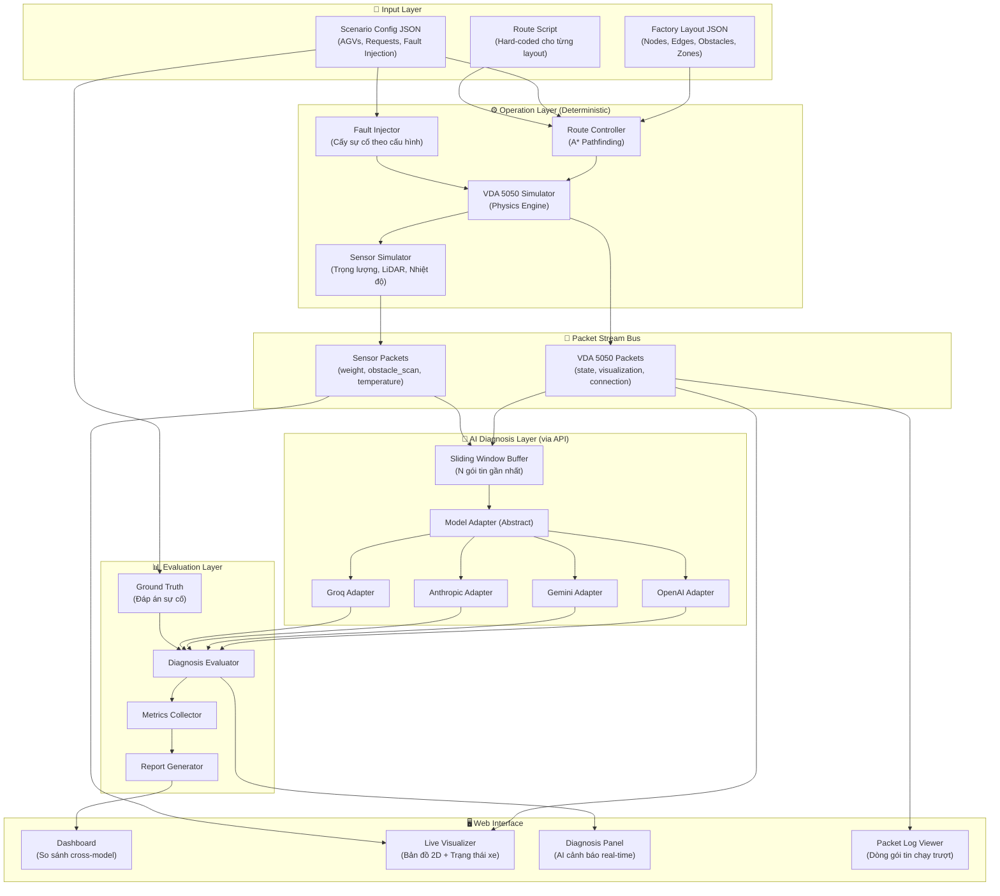
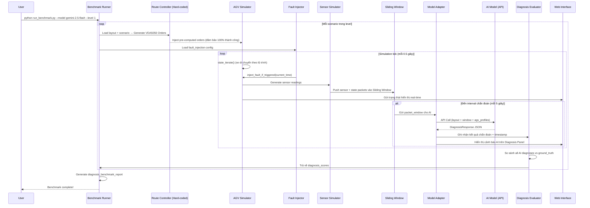

# AGV Anomaly Detection & Diagnosis Benchmark

Xây dựng hệ thống benchmark đánh giá khả năng **nhận biết lỗi, chẩn đoán nguyên nhân và đưa ra cảnh báo sớm** của các AI Models (gọi qua API) khi giám sát luồng dữ liệu vận hành xe AGV theo chuẩn VDA 5050 trong môi trường nhà máy giả lập.

## Tổng quan ý tưởng



**Luồng hoạt động cốt lõi:**
1. **Route Controller** (hard-coded) tự động điều hướng xe AGV chạy theo lộ trình tối ưu trên layout
2. **Fault Injector** cấy sự cố vào quá trình vận hành tại thời điểm được cấu hình (pin rò rỉ, xe kẹt, mất kết nối, quá tải trọng...)
3. **Packet Stream** phát liên tục các gói tin VDA 5050 (state, visualization, sensor) ra bus chung
4. Bản sao luồng gói tin được gửi đồng thời đến cả **Simulator** (hiển thị trên web) và **AI Model** (chẩn đoán)
5. AI Model phân tích luồng gói tin theo cửa sổ trượt (Sliding Window), phát hiện bất thường, xác định nguyên nhân gốc và đề xuất giải pháp
6. **Evaluator** so sánh kết quả chẩn đoán của AI với đáp án sự cố (ground truth) để chấm điểm

---

## Kiến trúc hệ thống



---

## Cấu trúc thư mục

```
vda5050-robot-simulator/
├── config.toml                          # Config MQTT + simulation
├── config.py                            # Config loader
├── main.py                              # VDA5050 Simulator core
├── mqtt_utils.py                        # MQTT utilities
├── utils.py                             # Helper functions
├── protocol/                            # VDA5050 protocol definitions
│
├── operations/                          # ★ MỚI - Hard-coded route controllers
│   ├── __init__.py
│   ├── base_router.py                   # Abstract base class (A* pathfinding)
│   ├── simple_warehouse_ops.py          # Routes cho simple_warehouse layout
│   ├── multi_zone_factory_ops.py        # Routes cho multi_zone_factory layout
│   ├── complex_factory_ops.py           # Routes cho complex_factory layout
│   └── fault_injector.py               # Bộ cấy sự cố (pin rò, mất mạng, kẹt xe...)
│
├── sensors/                             # ★ MỚI - Sensor simulation
│   ├── __init__.py
│   ├── weight_sensor.py                 # Cảm biến cân trọng lượng
│   ├── lidar_scanner.py                 # Cảm biến quét vật cản LiDAR
│   ├── temperature_monitor.py           # Cảm biến nhiệt độ động cơ
│   ├── encoder_sensor.py               # Cảm biến tốc độ bánh xe (Encoder)
│   └── battery_monitor.py              # Giám sát dung lượng pin chi tiết
│
├── benchmark/                           # ★ CẬP NHẬT - Diagnosis benchmark engine
│   ├── __init__.py
│   ├── runner.py                        # Benchmark orchestrator (chạy sim + gửi log cho AI)
│   ├── diagnosis_evaluator.py           # So sánh chẩn đoán AI vs ground truth
│   ├── metrics.py                       # Metrics chẩn đoán (detection latency, accuracy...)
│   ├── packet_logger.py                 # Ghi lại toàn bộ gói tin vào/ra
│   ├── sliding_window.py               # Bộ đệm cửa sổ trượt gói tin
│   └── report_generator.py             # Xuất báo cáo kết quả
│
├── models/                              # ★ CẬP NHẬT - AI Model adapters (chẩn đoán)
│   ├── __init__.py
│   ├── base_adapter.py                  # Abstract base - diagnose_stream()
│   ├── openai_adapter.py               # GPT-4o / o3
│   ├── gemini_adapter.py               # Gemini 2.5 Pro/Flash
│   ├── anthropic_adapter.py            # Claude Opus/Sonnet
│   ├── groq_adapter.py                 # Llama / Qwen qua Groq
│   └── qwen_adapter.py                 # Qwen Max qua Alibaba Cloud
│
├── scenarios/                           # ★ CẬP NHẬT - Kịch bản sự cố
│   ├── level_1_single_fault/            # Cấp 1: 1 sự cố đơn lẻ, rõ ràng
│   ├── level_2_multi_fault/             # Cấp 2: Nhiều sự cố đồng thời
│   ├── level_3_cascading/               # Cấp 3: Sự cố dây chuyền (domino)
│   ├── level_4_subtle/                  # Cấp 4: Sự cố tinh vi, khó phát hiện
│   └── level_5_realworld/               # Cấp 5: Mô phỏng sự cố thực tế nhà máy
│
├── factory_layouts/                     # ★ CẬP NHẬT - Bản đồ phức tạp hơn
│   ├── simple_warehouse.json            # 6 nodes, 6 edges (hiện tại)
│   ├── multi_zone_factory.json          # 20+ nodes, nhiều zone, hành lang hẹp
│   ├── complex_factory.json             # 40+ nodes, multi-floor, conveyor belts
│   └── mega_distribution_center.json    # 80+ nodes, 20+ xe, khu vực đông đúc
│
├── frontend/                            # ★ CẬP NHẬT - Web interface
│   └── index.html                       # SPA với Live Visualizer + Diagnosis Panel
│
├── results/                             # Kết quả benchmark
│   └── {model_name}_{timestamp}/
│       ├── diagnosis_report.json        # Báo cáo chẩn đoán
│       ├── packet_log.jsonl             # Toàn bộ gói tin
│       └── diagnosis_timeline.json      # Dòng thời gian phát hiện lỗi
│
├── app.py                               # FastAPI backend
├── run_benchmark.py                     # Entry point chạy benchmark
└── Dockerfile                           # Deploy lên Hugging Face
```

---

## Chi tiết thiết kế từng thành phần

### 1. Factory Layout (Bản đồ nhà máy - Nâng cấp)

Layout mới sẽ phức tạp hơn đáng kể so với `simple_warehouse` hiện tại:

```json
{
  "layout_id": "multi_zone_factory",
  "layout_name": "Multi-Zone Manufacturing Factory",
  "map_id": "factory_01",
  "dimensions": { "width": 120.0, "height": 100.0 },

  "nodes": [
    { "node_id": "DOCK_IN_1", "x": 5.0, "y": 10.0, "type": "dock", "description": "Inbound Dock 1" },
    { "node_id": "DOCK_IN_2", "x": 5.0, "y": 30.0, "type": "dock", "description": "Inbound Dock 2" },
    { "node_id": "CHARGING_1", "x": 10.0, "y": 90.0, "type": "charging", "description": "Charging Station 1" },
    { "node_id": "CHARGING_2", "x": 110.0, "y": 90.0, "type": "charging", "description": "Charging Station 2" },
    { "node_id": "ASSEMBLY_A", "x": 50.0, "y": 50.0, "type": "assembly", "description": "Assembly Line A" },
    { "node_id": "ASSEMBLY_B", "x": 80.0, "y": 50.0, "type": "assembly", "description": "Assembly Line B" },
    { "node_id": "QC_STATION", "x": 100.0, "y": 30.0, "type": "inspection", "description": "Quality Control" },
    { "node_id": "STORAGE_A1", "x": 30.0, "y": 70.0, "type": "storage", "description": "Raw Material Storage A1" },
    { "node_id": "STORAGE_A2", "x": 60.0, "y": 70.0, "type": "storage", "description": "Finished Goods Storage A2" },
    { "node_id": "DOCK_OUT_1", "x": 115.0, "y": 10.0, "type": "dock", "description": "Outbound Dock 1" }
  ],

  "edges": [
    { "edge_id": "E01", "start_node_id": "DOCK_IN_1", "end_node_id": "STORAGE_A1", "max_speed": 1.5, "one_way": false },
    { "edge_id": "E02", "start_node_id": "STORAGE_A1", "end_node_id": "ASSEMBLY_A", "max_speed": 1.2, "one_way": false },
    { "edge_id": "E03", "start_node_id": "ASSEMBLY_A", "end_node_id": "QC_STATION", "max_speed": 1.0, "one_way": true },
    { "edge_id": "E04", "start_node_id": "QC_STATION", "end_node_id": "DOCK_OUT_1", "max_speed": 1.5, "one_way": true }
  ],

  "obstacles": [
    { "obstacle_id": "WALL_ASSEMBLY", "type": "wall", "vertices": [[40.0, 40.0], [90.0, 40.0], [90.0, 60.0], [40.0, 60.0]] },
    { "obstacle_id": "PILLAR_01", "type": "pillar", "center": [25.0, 50.0], "radius": 1.5 },
    { "obstacle_id": "CONVEYOR_BELT", "type": "conveyor", "vertices": [[45.0, 45.0], [85.0, 45.0]], "speed": 0.3 }
  ],

  "zones": [
    { "zone_id": "CHARGING_ZONE_1", "type": "charging", "bounds": { "x_min": 5, "y_min": 85, "x_max": 20, "y_max": 95 } },
    { "zone_id": "RESTRICTED_MAINTENANCE", "type": "restricted", "bounds": { "x_min": 95, "y_min": 40, "x_max": 120, "y_max": 60 } },
    { "zone_id": "HIGH_TRAFFIC_CORRIDOR", "type": "high_traffic", "bounds": { "x_min": 20, "y_min": 25, "x_max": 100, "y_max": 35 }, "max_agvs": 3 },
    { "zone_id": "COLD_STORAGE", "type": "cold_storage", "bounds": { "x_min": 55, "y_min": 65, "x_max": 75, "y_max": 80 }, "temperature_c": -5.0 }
  ],

  "sensors": {
    "floor_weight_sensors": [
      { "sensor_id": "WS_01", "location": { "x": 50.0, "y": 50.0 }, "max_load_kg": 500.0 },
      { "sensor_id": "WS_02", "location": { "x": 80.0, "y": 50.0 }, "max_load_kg": 500.0 }
    ],
    "proximity_scanners": [
      { "sensor_id": "PS_01", "location": { "x": 30.0, "y": 30.0 }, "range_m": 5.0, "angle_deg": 270 }
    ]
  }
}
```

---

### 2. Scenario (Kịch bản sự cố - Cấu trúc mới)

Mỗi scenario giờ đây mô tả một bài kiểm thử **khả năng chẩn đoán lỗi**, không phải khả năng điều hướng:

```json
{
  "scenario_id": "scenario_101",
  "scenario_name": "Battery Leak Detection During Transport",
  "level": 1,
  "description": "Xe AGV_02 bị rò rỉ pin nghiêm trọng khi đang vận chuyển hàng nặng. AI cần phát hiện sự bất thường về tốc độ hao pin và cảnh báo trước khi xe chết máy.",
  "factory_layout": "multi_zone_factory",
  "route_script": "multi_zone_factory_ops",

  "agvs": [
    {
      "serial_number": "AGV_01",
      "initial_position": { "x": 5.0, "y": 10.0 },
      "battery_charge": 100.0,
      "speed": 1.2,
      "max_load_kg": 200.0,
      "sensors": ["weight", "lidar", "temperature", "encoder"]
    },
    {
      "serial_number": "AGV_02",
      "initial_position": { "x": 5.0, "y": 30.0 },
      "battery_charge": 85.0,
      "speed": 1.0,
      "max_load_kg": 150.0,
      "sensors": ["weight", "lidar", "temperature", "encoder"]
    }
  ],

  "transport_requests": [
    {
      "request_id": "REQ_001",
      "pickup_node": "DOCK_IN_1",
      "dropoff_node": "ASSEMBLY_A",
      "assigned_agv": "AGV_01",
      "payload_type": "raw_material",
      "payload_weight_kg": 80.0
    },
    {
      "request_id": "REQ_002",
      "pickup_node": "DOCK_IN_2",
      "dropoff_node": "STORAGE_A1",
      "assigned_agv": "AGV_02",
      "payload_type": "heavy_pallet",
      "payload_weight_kg": 140.0
    }
  ],

  "fault_injection": [
    {
      "fault_id": "FAULT_001",
      "type": "battery_leak",
      "target_agv": "AGV_02",
      "trigger": { "type": "time", "at_second": 15.0 },
      "parameters": {
        "drain_rate_multiplier": 5.0,
        "description": "Pin AGV_02 bắt đầu rò rỉ nghiêm trọng từ giây thứ 15, tốc độ hao pin tăng gấp 5 lần bình thường"
      }
    }
  ],

  "ground_truth": {
    "expected_anomalies": [
      {
        "anomaly_id": "ANO_001",
        "type": "battery_abnormal_drain",
        "severity": "critical",
        "affected_agv": "AGV_02",
        "onset_time_s": 15.0,
        "critical_time_s": 45.0,
        "root_cause": "Battery cell malfunction causing 5x normal drain rate while carrying heavy load (140kg)",
        "recommended_actions": [
          "Redirect AGV_02 to nearest charging station (CHARGING_1)",
          "Transfer REQ_002 to AGV_01 after AGV_01 completes current task",
          "Schedule maintenance inspection for AGV_02 battery pack"
        ]
      }
    ]
  },

  "constraints": {
    "max_simulation_time_s": 120,
    "diagnosis_window_size": 15,
    "diagnosis_interval_s": 5.0
  }
}
```

---

### 3. Hệ thống cấp độ Benchmark (Mới)

| Cấp độ | Tên | Mô tả | Số xe | Số sự cố | Độ khó nhận biết |
|--------|------|--------|-------|-----------|------------------|
| **Level 1** | Single Fault | 1 sự cố đơn lẻ, dấu hiệu rõ ràng | 2-3 | 1 | Thấp |
| **Level 2** | Multi Fault | Nhiều sự cố đồng thời, độc lập | 3-5 | 2-3 | Trung bình |
| **Level 3** | Cascading | Sự cố dây chuyền (lỗi A gây ra lỗi B) | 5-8 | 3-5 (chained) | Cao |
| **Level 4** | Subtle | Sự cố tinh vi, diễn biến chậm | 5-10 | 2-3 (hidden) | Rất cao |
| **Level 5** | Real-world | Mô phỏng sự cố nhà máy thực tế | 10-20 | 5+ (complex) | Cực cao |

**Chi tiết từng cấp:**

**Level 1 - Single Fault (5-10 scenarios):**
- Scenario 101: Pin rò rỉ đột ngột trên 1 xe khi đang chở hàng nặng
- Scenario 102: Cảm biến LiDAR bị che khuất (quét vật cản trả về dữ liệu sai)
- Scenario 103: Xe bị kẹt tại 1 node (trạng thái `RUNNING` nhưng tọa độ không thay đổi)
- Scenario 104: Quá tải trọng (cân nặng payload vượt `max_load_kg` của xe)
- Scenario 105: Nhiệt độ động cơ tăng bất thường khi xe chạy liên tục

**Level 2 - Multi Fault (5-10 scenarios):**
- Scenario 201: 2 xe cùng lúc: 1 xe pin rò + 1 xe quá tải trọng
- Scenario 202: 1 xe mất kết nối Wi-Fi + 1 xe khác bị kẹt tại giao lộ
- Scenario 203: Cảm biến cân bị lệch (báo sai 20%) + pin yếu dần
- Scenario 204: 2 xe đối đầu deadlock + 1 xe bên cạnh mất phanh
- Scenario 205: Vật cản động xuất hiện bất ngờ + 1 xe vào vùng cấm

**Level 3 - Cascading Fault (5-10 scenarios):**
- Scenario 301: Xe A hỏng chắn đường → Xe B bị kẹt → Xe C đi vòng cạn pin
- Scenario 302: Mất Wi-Fi hub → 3 xe mất kết nối → 1 xe chạy tự do không kiểm soát
- Scenario 303: Quá tải trọng → Phanh mòn → Trượt bánh → Va chạm tường
- Scenario 304: Pin rò → Xe dừng giữa hành lang hẹp → 4 xe phía sau bị kẹt dây chuyền
- Scenario 305: Cảm biến nhiệt hỏng → Không phát hiện quá nhiệt → Động cơ cháy

**Level 4 - Subtle Fault (5-10 scenarios):**
- Scenario 401: Pin hao chậm hơn bình thường 10% (dấu hiệu cell yếu, khó nhận biết)
- Scenario 402: Encoder báo tốc độ sai lệch 5% (xe đi chệch lộ trình dần dần)
- Scenario 403: Cảm biến cân drift +2kg mỗi phút (tích lũy lỗi)
- Scenario 404: Gói tin trạng thái bị trễ 500ms (intermittent network jitter)
- Scenario 405: 1 trong 10 xe âm thầm bỏ qua lệnh dừng (firmware bug)

**Level 5 - Real-world (5-10 scenarios):**
- Scenario 501: Mô phỏng sự cố cháy kho: Nhiều xe phải sơ tán khẩn cấp đồng thời
- Scenario 502: Ca làm việc đông đúc: 20 xe + hành lang tắc + pin thấp hàng loạt
- Scenario 503: Bảo trì định kỳ: 3 xe lần lượt offline, hệ thống phải tái phân bổ
- Scenario 504: Sự cố điện: Toàn bộ trạm sạc mất nguồn, xe phải tiết kiệm pin
- Scenario 505: Hack/Xâm nhập: 1 xe nhận lệnh giả mạo di chuyển bất thường

---

### 4. Sensor Simulation (Mô phỏng cảm biến)

Mỗi xe AGV sẽ phát ra các gói tin cảm biến bổ sung ngoài gói tin VDA 5050 tiêu chuẩn:

```json
{
  "timestamp": "2026-07-09T04:15:30.500Z",
  "agv_id": "AGV_02",
  "packet_type": "sensor_data",
  "sensors": {
    "weight": {
      "current_load_kg": 142.3,
      "max_capacity_kg": 150.0,
      "load_percentage": 94.9,
      "overload_warning": true
    },
    "lidar": {
      "scan_points": 360,
      "nearest_obstacle_m": 0.8,
      "obstacle_direction_deg": 45,
      "scan_quality": "degraded",
      "blocked_sectors": [40, 50]
    },
    "temperature": {
      "motor_left_c": 72.5,
      "motor_right_c": 68.1,
      "battery_c": 45.2,
      "ambient_c": 22.0,
      "motor_warning_threshold_c": 80.0
    },
    "encoder": {
      "left_wheel_rpm": 120.5,
      "right_wheel_rpm": 118.2,
      "speed_mps": 1.15,
      "odometer_m": 342.7,
      "wheel_slip_detected": false
    },
    "battery": {
      "voltage_v": 47.2,
      "current_a": 12.5,
      "charge_percent": 62.3,
      "drain_rate_pct_per_min": 1.8,
      "estimated_remaining_min": 34.6,
      "cell_health": [98, 97, 95, 72, 96, 94],
      "temperature_c": 45.2
    }
  }
}
```

---

### 5. Operation Layer (Lớp vận hành - Hard-coded)

Mỗi layout sẽ có một file Python riêng chứa logic vận hành tối ưu:

```python
# operations/base_router.py
class BaseRouteController:
    """Abstract base class cho route controllers"""

    def __init__(self, layout: dict, scenario: dict):
        self.layout = layout
        self.scenario = scenario
        self.graph = self._build_graph()

    def _build_graph(self) -> dict:
        """Xây dựng đồ thị từ layout JSON"""
        # Dùng thuật toán A* / Dijkstra để tính toàn bộ lộ trình tối ưu
        raise NotImplementedError

    def get_vda5050_orders(self) -> list[dict]:
        """Trả về danh sách VDA5050 Orders cho toàn bộ AGVs"""
        # Đảm bảo 100% thành công, không va chạm, không deadlock
        raise NotImplementedError

    def get_expected_timeline(self) -> list[dict]:
        """Trả về dòng thời gian dự kiến của toàn bộ quá trình vận hành"""
        raise NotImplementedError
```

```python
# operations/multi_zone_factory_ops.py
class MultiZoneFactoryRouter(BaseRouteController):
    """Hard-coded route controller cho multi_zone_factory layout"""

    def get_vda5050_orders(self):
        orders = []
        for request in self.scenario["transport_requests"]:
            agv = request["assigned_agv"]
            path = self._astar(request["pickup_node"], request["dropoff_node"])
            order = self._path_to_vda5050_order(agv, path, request)
            orders.append(order)
        return orders
```

---

### 6. Fault Injector (Bộ cấy sự cố)

```python
# operations/fault_injector.py
class FaultInjector:
    """Cấy sự cố vào quá trình vận hành theo cấu hình scenario"""

    FAULT_TYPES = {
        "battery_leak":           "Pin rò rỉ, tăng tốc độ hao pin",
        "battery_sudden_death":   "Pin chết đột ngột (0%)",
        "motor_overheat":         "Động cơ quá nhiệt, giảm tốc độ",
        "lidar_blocked":          "Cảm biến LiDAR bị che, trả về dữ liệu sai",
        "encoder_drift":          "Encoder báo tốc độ sai lệch, xe đi chệch",
        "weight_sensor_drift":    "Cảm biến cân bị drift, báo sai trọng lượng",
        "connection_loss":        "Mất kết nối MQTT tạm thời hoặc vĩnh viễn",
        "stuck_at_node":          "Xe kẹt tại node, không di chuyển được",
        "brake_failure":          "Mất phanh, xe không dừng được tại node đích",
        "overload":               "Chở quá tải trọng cho phép",
        "firmware_bug":           "Xe bỏ qua lệnh dừng (firmware lỗi)",
        "rogue_movement":         "Xe di chuyển bất thường không theo lệnh",
        "zone_violation":         "Xe xâm nhập vùng cấm",
        "conveyor_jam":           "Băng chuyền kẹt, xe không giao/nhận hàng được"
    }

    def inject(self, simulator_state, fault_config, current_time_s):
        """Kiểm tra và áp dụng sự cố nếu đến thời điểm kích hoạt"""
        ...
```

---

### 7. Model Adapter Layer (Chẩn đoán - Cấu trúc mới)

```python
# models/base_adapter.py
class BaseModelAdapter:
    """Base adapter cho tất cả AI Models - Nhiệm vụ CHẨN ĐOÁN"""

    def diagnose_stream(
        self,
        factory_layout: dict,
        packet_window: list[dict],
        agv_profiles: list[dict]
    ) -> DiagnosisResponse:
        """
        Input:
        - factory_layout: Bản đồ nhà máy (nodes, edges, obstacles, zones, sensors)
        - packet_window: Cửa sổ trượt N gói tin gần nhất (state + sensor)
        - agv_profiles: Thông số kỹ thuật của từng xe (max_load, sensor list...)

        Output:
        - DiagnosisResponse chứa danh sách anomalies phát hiện được
        """
        raise NotImplementedError
```

**Output schema mong đợi từ AI:**

```json
{
  "diagnosis_timestamp": "2026-07-09T04:15:35Z",
  "anomalies_detected": [
    {
      "anomaly_type": "battery_abnormal_drain",
      "severity": "critical",
      "confidence": 0.92,
      "affected_agv": "AGV_02",
      "evidence": [
        "Battery dropped from 72% to 58% in last 30 seconds (normal rate: 1.8%/min, observed: 28%/min)",
        "Cell health array shows cell_4 at 72% while others above 94%",
        "Battery temperature elevated at 45.2°C (ambient 22°C)"
      ],
      "root_cause_analysis": "AGV_02 battery cell #4 is failing, causing abnormal drain amplified by heavy load (140kg, 94.9% capacity)",
      "recommended_actions": [
        "IMMEDIATE: Redirect AGV_02 to CHARGING_1 (nearest charging station)",
        "SHORT-TERM: Transfer REQ_002 to AGV_01 after current task completion",
        "LONG-TERM: Replace AGV_02 battery module, inspect cell #4"
      ],
      "predicted_failure_time_s": 45.0
    }
  ],
  "system_status": "WARNING",
  "fleet_health_summary": "1/2 AGVs require attention. Fleet capacity reduced to 50%."
}
```

> [!IMPORTANT]
> **Prompt Engineering Strategy (Mới):**
> - System prompt mô tả vai trò **"Fleet Diagnostic Engineer"** thay vì "Fleet Controller"
> - Cung cấp factory layout để AI hiểu ngữ cảnh không gian
> - Cung cấp thông số kỹ thuật xe (max_load, sensor specs) để AI biết ngưỡng bình thường
> - Cung cấp **Sliding Window** (cửa sổ trượt) N gói tin gần nhất thay vì toàn bộ log
> - Yêu cầu AI trả output dạng JSON chẩn đoán có cấu trúc (anomaly type, severity, evidence, root cause, actions)
> - Đặc biệt: Yêu cầu AI ước tính **thời gian sự cố sẽ trở nên nghiêm trọng** (predicted_failure_time)

---

### 8. Metrics & Evaluator (Chỉ số đánh giá - Mới hoàn toàn)

| Metric | Mô tả | Loại |
|--------|--------|------|
| `detection_accuracy` | % anomaly phát hiện đúng loại so với ground truth | Core |
| `false_positive_rate` | % cảnh báo sai (AI phát hiện lỗi nhưng thực tế không có) | Core |
| `false_negative_rate` | % bỏ sót (Có lỗi nhưng AI không phát hiện) | Core |
| `detection_latency_s` | Thời gian từ lúc lỗi xảy ra đến lúc AI phát hiện (giây) | Performance |
| `root_cause_accuracy` | % AI xác định đúng nguyên nhân gốc | Quality |
| `action_relevance` | Mức độ phù hợp của giải pháp đề xuất (0-1) | Quality |
| `severity_accuracy` | AI đánh giá đúng mức độ nghiêm trọng (low/medium/high/critical) | Quality |
| `prediction_accuracy` | Độ chính xác dự đoán thời gian hỏng (sai lệch giây) | Advanced |
| `model_latency_ms` | Thời gian API trả về kết quả chẩn đoán (ms) | Performance |
| `cost_per_diagnosis` | Chi phí token/USD cho mỗi lần chẩn đoán | Cost |

**Cơ chế chấm điểm:**

```python
# benchmark/diagnosis_evaluator.py
class DiagnosisEvaluator:
    """So sánh kết quả chẩn đoán AI vs ground truth"""

    def evaluate(self, ai_diagnosis: dict, ground_truth: dict) -> dict:
        scores = {}

        # 1. Detection Accuracy (0-100%)
        detected_types = {a["anomaly_type"] for a in ai_diagnosis["anomalies_detected"]}
        expected_types = {a["type"] for a in ground_truth["expected_anomalies"]}
        scores["detection_accuracy"] = len(detected_types & expected_types) / len(expected_types) * 100

        # 2. False Positive Rate
        false_positives = detected_types - expected_types
        scores["false_positive_count"] = len(false_positives)

        # 3. Detection Latency
        # So sánh thời gian AI phát hiện vs onset_time trong ground truth
        ...

        # 4. Root Cause Accuracy
        # Dùng semantic similarity để so sánh mô tả nguyên nhân
        ...

        # 5. Action Relevance
        # Đánh giá các recommended_actions có khớp với ground truth không
        ...

        return scores
```

**Báo cáo kết quả mẫu:**

```
## Diagnosis Benchmark Report: Gemini 2.5 Flash - 2026-07-09

### Tổng quan
- Model: gemini-2.5-flash
- Tổng scenarios: 25
- Phát hiện đúng: 20/25 (80%)
- Cảnh báo sai (False Positive): 3
- Bỏ sót (False Negative): 5

### Kết quả theo cấp độ
| Level | Detect | Miss | FP | Accuracy | Avg Latency |
|-------|--------|------|------|----------|-------------|
| L1    | 5/5    | 0    | 0    | 100%     | 2.1s        |
| L2    | 5/5    | 0    | 1    | 100%     | 3.5s        |
| L3    | 4/5    | 1    | 1    | 80%      | 5.2s        |
| L4    | 3/5    | 2    | 0    | 60%      | 8.1s        |
| L5    | 3/5    | 2    | 1    | 60%      | 12.3s       |

### Phân tích năng lực
| Fault Type           | Detect Rate | Avg Latency |
|----------------------|-------------|-------------|
| battery_leak         | 100%        | 1.5s        |
| overload             | 100%        | 0.8s        |
| motor_overheat       | 80%         | 3.2s        |
| deadlock             | 60%         | 8.5s        |
| encoder_drift        | 40%         | 15.0s       |
| firmware_bug         | 20%         | N/A         |
```

---

### 9. Packet Stream & Sliding Window

```python
# benchmark/sliding_window.py
class SlidingWindowBuffer:
    """Bộ đệm cửa sổ trượt cho gói tin VDA 5050 + Sensor"""

    def __init__(self, window_size: int = 15):
        self.window_size = window_size
        self.buffer = deque(maxlen=window_size)

    def push(self, packet: dict):
        """Thêm gói tin mới vào buffer"""
        self.buffer.append(packet)

    def get_window(self) -> list[dict]:
        """Lấy toàn bộ gói tin trong cửa sổ hiện tại"""
        return list(self.buffer)

    def get_summary(self) -> dict:
        """Tạo bản tóm tắt thống kê cho AI dễ đọc"""
        return {
            "window_start": self.buffer[0]["timestamp"],
            "window_end": self.buffer[-1]["timestamp"],
            "packet_count": len(self.buffer),
            "agvs_reporting": list(set(p["agv_id"] for p in self.buffer if "agv_id" in p)),
            "packets": self.get_window()
        }
```

---

### 10. Web Interface (Giao diện web - Nâng cấp)

Frontend sẽ hiển thị toàn bộ quy trình vận hành + chẩn đoán trên cùng một giao diện:

**Panel 1 - Live Map Visualizer (Trái):**
- Bản đồ 2D hiển thị layout nhà máy (nodes, edges, obstacles, zones)
- Xe AGV di chuyển real-time trên bản đồ (animation)
- Màu sắc xe thay đổi theo trạng thái (xanh=OK, vàng=warning, đỏ=critical)
- Hiển thị vùng cảm biến LiDAR quét xung quanh mỗi xe
- Highlight đỏ khi AI phát hiện anomaly

**Panel 2 - Packet Stream Viewer (Phải trên):**
- Dòng gói tin MQTT chạy trượt real-time (giống terminal log)
- Highlight màu theo loại gói tin (state=xanh, sensor=vàng, fault=đỏ)
- Click vào gói tin để xem chi tiết JSON

**Panel 3 - AI Diagnosis Panel (Phải dưới):**
- Bảng cảnh báo real-time từ AI Model
- So sánh song song kết quả chẩn đoán của nhiều model (Gemini vs GPT vs Claude)
- Hiển thị confidence score, severity, recommended actions
- Dòng thời gian (timeline) đánh dấu thời điểm AI phát hiện vs thời điểm lỗi thực sự xảy ra

**Panel 4 - Dashboard (Trang riêng):**
- Biểu đồ radar so sánh năng lực chẩn đoán cross-model
- Biểu đồ cột Detection Latency theo từng loại lỗi
- Bảng xếp hạng tổng hợp các model

---

## Luồng chạy Benchmark



---

## Thứ tự triển khai

### Phase 1: Operation Foundation (Nền tảng vận hành)
1. Thiết kế cấu trúc `operations/` với `base_router.py` và thuật toán A*
2. Tạo 2-3 factory layout mới phức tạp (multi_zone, complex)
3. Implement hard-coded route controllers cho từng layout
4. Kiểm thử đảm bảo xe chạy 100% thành công trên mọi layout
5. Implement `fault_injector.py` với tất cả loại sự cố

### Phase 2: Sensor & Packet Stream
6. Implement module `sensors/` (weight, lidar, temperature, encoder, battery)
7. Tích hợp sensor simulation vào main simulator loop
8. Implement `sliding_window.py` cho bộ đệm gói tin
9. Implement `packet_logger.py` ghi toàn bộ stream ra file JSONL

### Phase 3: AI Diagnosis Integration
10. Cập nhật `base_adapter.py` → `diagnose_stream()` thay vì `generate_orders()`
11. Thiết kế system prompt mới (Fleet Diagnostic Engineer)
12. Cập nhật tất cả model adapters (Gemini, OpenAI, Anthropic, Groq, Qwen)
13. Xây dựng `diagnosis_evaluator.py` + metrics mới

### Phase 4: Scenarios & Benchmark Engine
14. Tạo scenarios Level 1 (5 scenarios, single fault)
15. Tạo scenarios Level 2 (5 scenarios, multi fault)
16. Tạo scenarios Level 3-5 (nâng dần độ phức tạp)
17. Xây dựng `runner.py` mới (orchestrator sim + diagnosis)
18. Cập nhật `run_benchmark.py` entry point

### Phase 5: Web Interface Enhancement
19. Cập nhật Frontend: Live Map + Packet Stream Viewer + Diagnosis Panel
20. Thêm so sánh cross-model real-time trên giao diện
21. Thêm Dashboard biểu đồ tổng hợp

### Phase 6: Deployment
22. Cập nhật `Dockerfile` và deploy lên Hugging Face Spaces
23. Cập nhật Frontend deploy lên Vercel
24. Chạy benchmark toàn bộ scenarios trên tất cả models, cập nhật `report.md`
